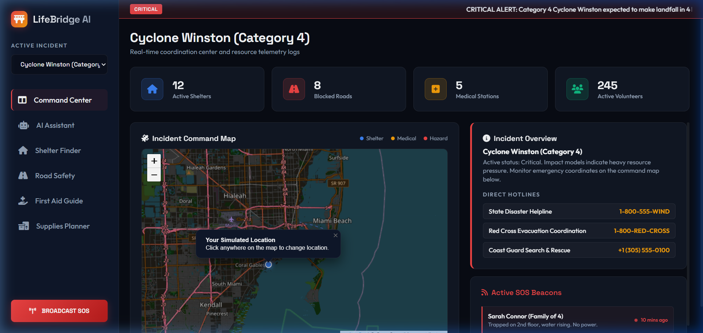
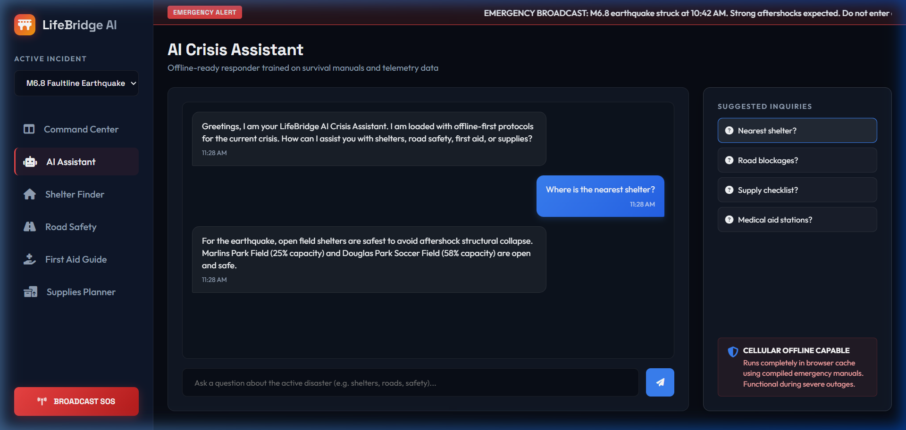
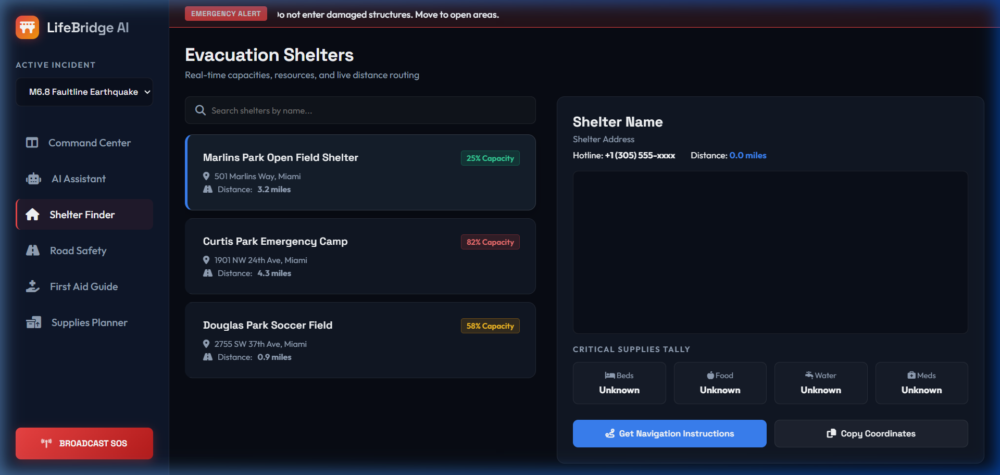
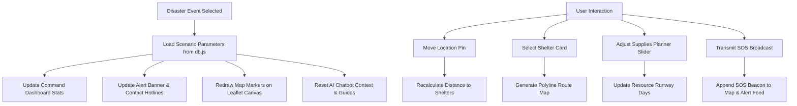

# LifeBridge AI ── Emergency Response & Disaster Assistant

### Track: Agents for Good

**LifeBridge AI** is a premium, offline-first incident coordination dashboard designed to assist citizens and rescue teams during sudden natural disasters (cyclones, flooding, earthquakes). In critical situations where power is unstable and cellular connections fluctuate, LifeBridge AI operates client-side to supply shelter maps, first aid instruction sets, road safety registries, and automated crisis-answering assistants.

---

## 📖 Table of Contents
1. [Objectives](#-objectives)
2. [Key Features](#-key-features)
3. [Technology Stack](#-technology-stack)
4. [Folder Structure](#-folder-structure)
5. [Installation & Local Setup](#-installation--local-setup)
6. [Interactive Walkthrough & Usage](#-interactive-walkthrough--usage)
7. [System Workflow](#-system-workflow)
8. [Future Scope](#-future-scope)

---

## 🎯 Objectives
- **Centralize Telemetry**: Unify shelter capacities, road hazard listings, and volunteer statistics under a single Command Center.
- **Support Offline Access**: Enable local-first script execution and asset configurations so citizens can search first-aid steps and supply checklists without active cellular networks.
- **Provide Actionable Intelligence**: Compute distances from coordinates to shelters automatically, bypassing manual search steps.
- **Simulate SOS Safety Beacons**: Formulate a localized network registry of emergency calls to help local responders locate trapped citizens.

---

## ⚡ Key Features

### 1. Incident Command Center
- Real-time ticker banner scrolling critical warnings.
- Real-time statistics counters tracking active shelters, blocked lanes, medical triage units, and volunteer counts.
- High-fidelity **Leaflet GIS Map** displaying interactive markers (Shelters, Hazards, Medical Camps) customized to the active disaster.

### 2. AI Crisis Chatbot Assistant
- Offline-ready, fast-response query engine matching natural language triggers.
- Prompt suggestion chips for common concerns (e.g., "Where is the nearest shelter?", "Which roads are blocked?").
- Dynamic simulated typing animations and contextual advice based on the selected disaster type.

### 3. Evacuation Shelter Finder
- Searchable directory of nearby safe houses showing distance in miles, phone hotlines, and resource meters (beds, food, water, medicine).
- Detail GIS router map generating polyline pathways from the user's current location to the shelter.

### 4. Road Hazards & Safety Logs
- Segmented table tracking road conditions (Blocked, Closed, Slow Traffic) alongside incident explanations (debris, flooding, concrete column damage).

### 5. First Aid & Emergency Triage Guide
- Diagnostic menu featuring step-by-step instructions for severe bleeding, fracture splints, CPR, burns, and choking rescue.
- Fully searchable triage card index with colored warnings and critical reminders.

### 6. Emergency Supplies Planner
- Dynamic kit builder combining core survival elements with incident-specific provisions (e.g. tarps for cyclones, rubber boots for floods, N95 masks for earthquakes).
- Runway calculator computing drinking water and meal reserves against family size to alert users when below the recommended 3-day buffer.

### 7. SOS Beacon Broadcaster
- Large neon red SOS trigger opening a dispatch form to mock-transmit user details, location coordinates, family size, and immediate medical needs.

---

## 🛠️ Technology Stack
- **Structure**: Semantic HTML5 markup
- **Design & Layout**: Custom CSS3 variables, flexbox/grid layout systems, glassmorphism card overlays, and dynamic keyframe animations.
- **Map engine**: [Leaflet.js](https://leafletjs.com/) (OpenStreetMap API) for light-weight, highly customizable routing and custom SVG marker pins.
- **Icons & Fonts**: [FontAwesome v6](https://fontawesome.com/) & Google Fonts (Outfit, Space Grotesk).
- **Execution Logic**: Plain Vanilla JavaScript (ES6+ modular organization).

---

## 📁 Folder Structure
```text
c:\capstone project\
├── index.html            # Main dashboard shell, HTML5 layout, & views
├── README.md             # Developer documentation and overview
├── css/
│   └── style.css         # Styling system, responsive grid framework, dark theme
└── js/
    ├── app.js            # Core application router and view orchestrator
    ├── db.js             # Mock database with Cyclone, Flood, & Earthquake records
    ├── map.js            # Leaflet map manager, mark points, & distance calculators
    ├── chat.js           # Chatbot message logic and keyword response patterns
    ├── medical.js        # first-aid lookup search and triage guides
    └── supplies.js       # Checklist updates and supply runway math formulas
```

---

## 🚀 Installation & Local Setup

### Prerequisites
Make sure you have Node.js installed to serve the files locally.

### Steps
1. Clone this repository or open the project folder in terminal.
2. Initialize a local web server to serve the static assets (required to prevent CORS policy restrictions on Leaflet maps):
   ```bash
   npx -y serve -l 8000
   ```
3. Open your browser and navigate to:
   ```text
   http://localhost:8000
   ```

---

## 📸 App Preview Screenshots

### 1. Incident Command Center Dashboard
The main coordination dashboard displays telemetry statistics, active incident bulletins, and an interactive Leaflet GIS map tracking shelters, medical aid stations, and road hazards.


### 2. AI Crisis Chatbot Assistant
Switching to the Assistant view allows citizens to query the offline-ready responder for disaster recommendations.


### 3. Evacuation Shelter Finder
Selecting a shelter displays real-time bed, food, water, and medicine levels, and highlights the safety route from the simulated user location.


---

## 🖥️ Interactive Walkthrough & Usage

1. **Changing Incident Context**: Click the dropdown in the sidebar to switch between *Cyclone Winston*, *Riverine Flooding*, and *M6.8 Faultline Earthquake*. Observe how the entire dashboard (ticker message, statistics counters, Leaflet map markers, checklist parameters, and chatbot context) updates instantly.
2. **Updating Geolocation**: Click any point on the **Incident Command Map** to simulate moving your location. The blue user beacon will reposition, and all distances in the *Shelter Finder* list will update in real-time.
3. **Using the Chatbot**: Switch to the **AI Assistant** tab. Type a custom query like "Where can I get medical care?" or click the suggestion chips. The responder will respond with context-specific recommendations.
4. **Submitting SOS Signals**: Click **BROADCAST SOS** in the bottom left, fill in the emergency details, and click *Transmit Beacon*. The coordinates will map, and the report will log in the dashboard's Active SOS feed.

---

## 📊 System Workflow



---

## 🔮 Future Scope
- **Live Server Integration**: Move from mock JSON to real database APIs (e.g. Supabase, MongoDB) to store actual telemetry data.
- **P2P Offline Sync**: Implement WebRTC or Bluetooth mesh protocols allowing neighboring devices to sync emergency lists without internet.
- **Real-Time GPS Tracking**: Integrate HTML5 Geolocation API for automatic tracking on mobile phones.
- **SMS Gateway Hook**: Allow SOS transmissions to fall back to GSM SMS networks when internet packages fail.
